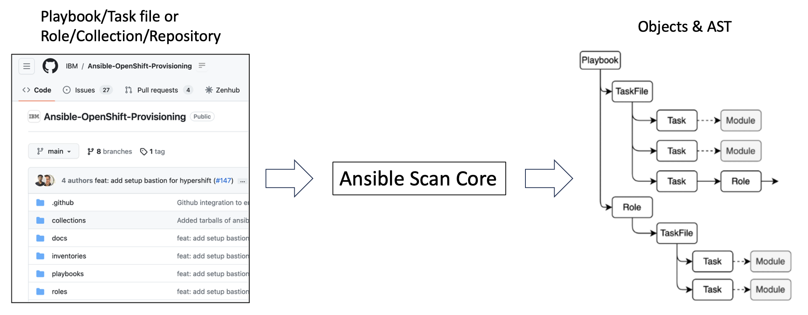

# Ansible Scan Core

Ansible Scan Core is a scanning framework for Ansible contents and it generates graph/intermediate/high-level representation of Ansible data.

It supports scanning for
- Playbook YAML
- Task YAML in a role
- Role
- Collection (including modules)
- Any type of Ansible project (e.g. Git repository)

and generates Python objects for each of the scanned contents. These objects are JSON serializable so that other projects/users can dump/load/process them depending on their requirements.

Today, the following projects utilize Ansible Scan Core for the scanning backend.

- [Ansible Risk Insight](https://github.com/ansible/ansible-risk-insight) - A risk evaluation tool for Ansible contents
- [Sage](https://github.com/IBM/sage) - A framework to process Ansible contents for the scanning results





## Object models

Ansible Scan Core scans Ansible contents and generates representation objects and abstract syntax tree (AST) which consists of Ansible-specific nodes like
- collections (all external dependencies)
- modules (name, fqcn, spec)
- playbooks (name, comment, filename)
- plays (name, comment, calling tasks and roles)
- projects (including playbooks, roles, dependencies, metadata)
- roles (including taskfiles, role metadata, variables, default, etc)
- taskfiles (calling tasks)
- tasks (task spec, callling module)

Each node is represented by unique identifier, and links between the nodes are created by analayzing Ansible-specific code semantics. For example, 
- call hierarlchy from playbook to role --> taskfile - task --> module
- variable assignment is inferred in a static-analytics fashion

## Installation

Run the following command after `git clone`.

```
$ pip install -e .
```

### Getting started

```python
from ansbile_scan_core.scanner import AnsibleScanner

scanner = AnsibleScanner()
scanner.run(target_dir="<PATH/TO/PROJECT>")

# Alternatively, you can run the scanning for a YAML string
# scanner.run(raw_yaml="<YAML_STRING>")
```

An example implementation [scan.py](examples/scan.py) is scanning the target directory/file and printing the loaded AST like `tree` command like the following.

You can refer to it as a reference of a scanning code and how to use the result objects.

```bash
# Single Playbook scanning
$ python examples/scan.py examples/single_playbook/playbook.yml

root
└──{"type": "playbook", "filepath": "examples/single_playbook/playbook.yml"}
     └──{"type": "play", "filepath": "examples/single_playbook/playbook.yml"}
          ├──{"type": "task", "filepath": "examples/single_playbook/playbook.yml", "lines": "4 - 8", "name": "Ensure apache is at the latest version", "module": "yum"}
          │    └──{"type": "module", "fqcn": "ansible.builtin.yum"}
          └──{"type": "task", "filepath": "examples/single_playbook/playbook.yml", "lines": "9 - 13", "name": "Ensure apache is running", "module": "service"}
               └──{"type": "module", "fqcn": "ansible.builtin.service"}
```

```bash
# Project scanning
$ python examples/scan.py examples/project

root
└──{"type": "role", "filepath": "roles/common", "default_variables": {"foo": "bar"}}
     └──{"type": "taskfile", "filepath": "roles/common/tasks/main.yml"}
          ├──{"type": "task", "filepath": "roles/common/tasks/main.yml", "lines": "2 - 5", "name": "Install the correct web server for RHEL", "module": "ansible.builtin.import_tasks"}
          │    └──{"type": "taskfile", "filepath": "roles/common/tasks/redhat.yml"}
          │         └──{"type": "task", "filepath": "roles/common/tasks/redhat.yml", "lines": "2 - 6", "name": "Install web server", "module": "ansible.builtin.yum"}
          │              └──{"type": "module", "fqcn": "ansible.builtin.yum"}
          ├──{"type": "task", "filepath": "roles/common/tasks/main.yml", "lines": "6 - 9", "name": "Install the correct web server for Debian", "module": "ansible.builtin.import_tasks"}
          │    └──{"type": "taskfile", "filepath": "roles/common/tasks/debian.yml"}
          │         └──{"type": "task", "filepath": "roles/common/tasks/debian.yml", "lines": "2 - 6", "name": "Install web server", "module": "ansible.builtin.apt"}
          │              └──{"type": "module", "fqcn": "ansible.builtin.apt"}
          └──{"type": "task", "filepath": "roles/common/tasks/main.yml", "lines": "10 - 13", "name": "Print a variable", "module": "debug"}
               └──{"type": "module", "fqcn": "ansible.builtin.debug"}
```